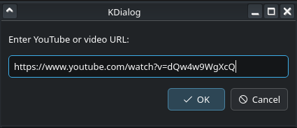
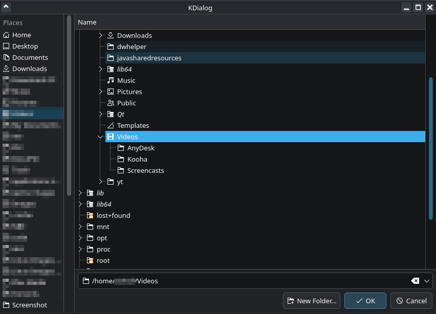
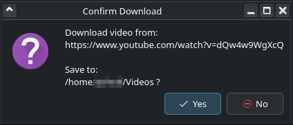
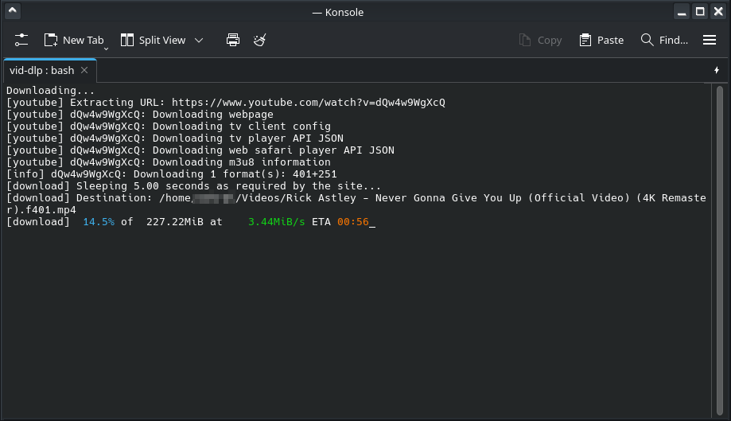
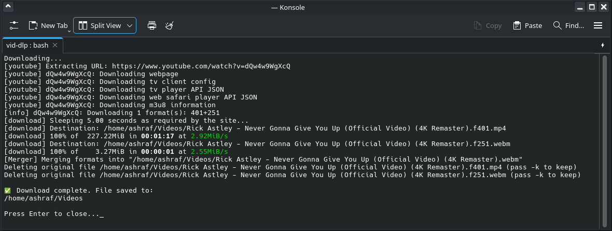

# vid-dlp KDE Downloader

A simple **YouTube and video downloader for Linux**, built with [`yt-dlp`](https://github.com/yt-dlp/yt-dlp) and [`kdialog`](https://develop.kde.org/docs/administration/kdialog/).

This script provides a **graphical interface** for downloading videos from YouTube and other supported sites.  
It uses `kdialog` to prompt you for the **video URL** and the **destination folder**, then opens **Konsole** to show live download progress.

> **Note:** Your system does **not need to run KDE Plasma** to use this script.  
> `kdialog` can be installed and used on any Linux desktop (GNOME, XFCE, Cinnamon, etc.) as long as the required Qt and KDE libraries are present.

---

## Features

- **GUI input** for URL and destination folder  
- Downloads **best-quality video + audio**
- Automatically names files using the video title
- Opens **Konsole** for real-time progress display
- Works with **any site supported by `yt-dlp`**
- Works on **any Linux desktop**, not just KDE

---

## Screenshots

### URL Input Dialog


### Folder Selection Dialog


### Confirmation Dialog


### Konsole Download Progress


### Konsole Download Competion result


---

## Requirements

You’ll need the following tools installed:

```bash
sudo pacman -S yt-dlp kdialog konsole ffmpeg        # Arch / Manjaro
sudo apt install yt-dlp kdialog konsole ffmpeg      # Debian / Ubuntu
sudo dnf install yt-dlp kdialog konsole ffmpeg      # Fedora
```

## How to Use the Script

Before running, ensure the script file is executable — this step is mandatory:

```bash
chmod +x vid-dlp.sh
```

## From Konsole:

```bash
vid-dlp.sh
```

---

# Credits

### Author
**Ashraf Mehdaly**  
[GitHub](https://github.com/amehdaly)

---

### Tools & Libraries
- **yt-dlp** — for downloading and merging media streams  
- **KDialog** — for GUI dialogs  
- **Konsole** — for progress display  
- **FFmpeg** — for post-processing  

---

### Acknowledgments
Thanks to:
- KDE community for developing the core desktop components used here  
- yt-dlp maintainers for keeping the project fast and up to date  
- Everyone who contributes bug reports or improvements to this script

---
 
## License

This project is licensed under the [MIT License](LICENSE).
